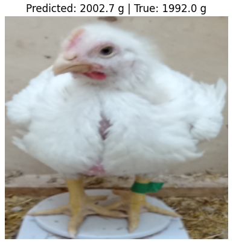
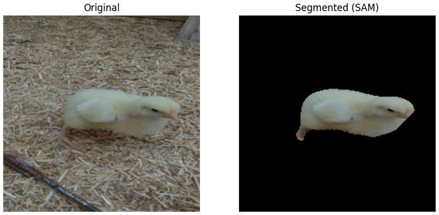
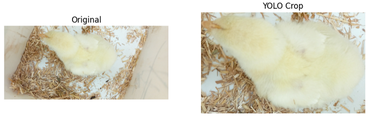

# Poultry Vision Monitoring

Computer vision system for intelligent poultry monitoring, focused on weight estimation and disease detection.

---

## Project context

This project is developed as part of the course:

Proxecto Integrador de Intelixencia Artificial I (PIIA1)  
Bachelor's Degree in Artificial Intelligence  
Universidade de Santiago de Compostela

In collaboration with **Balidea**, as part of an industry-oriented academic initiative.

---

## Objective

The goal of the project is to explore and develop computer vision techniques to address key use cases in poultry monitoring, including weight estimation and disease detection.

---

## Project structure

The project is divided into two main application areas:

- **Weight estimation**
- **Disease detection**

Both tasks have independent data processing pipelines and documentation.

---

## Weight Estimation

### Current Results

At the current stage of the project, the best-performing model is based on a pretrained **ResNet50** with fine-tuning of the final layers.

This approach achieves:

- **MAE ≈ 38.8 grams**
- **Mean relative error ≈ 10.1%**

### Visual results

- **FINAL MODEL PREDICTION:** The model provides accurate weight estimation directly from raw images.

<p align="center">
  
</p>

- **EXPLORED APPROACHES:** We also explored alternative preprocessing strategies based on segmentation and object detection.

<p align="center">
  
</p>

<p align="center">
  
</p>

---

## Repository structure

The repository focuses on code and documentation.

```text
data/ (ignored in Github)
    01_raw/        -> original datasets
    02_work/       -> intermediate processed datasets
    03_final/      -> final datasets (stored in Hugging Face)

docs/
    weight_datasets.md    -> documentation for weight estimation datasets
    disease_datasets.md   -> documentation for disease detection datasets

images/
    -> visual results and qualitative examples

notebooks/
    weight_estimation/
        01_weight_estimation_baseline.ipynb
        02_weight_estimation_improvements.ipynb
        03_weight_estimation_transfer_learning.ipynb
        04_weight_estimation_finetuning_and_SAM_segmentation.ipynb
        05_weight_estimation_yolo_preprocessing.ipynb
        06_weight_estimation_resnet50.ipynb
    disease_detection/
        poultry_feces_classification_workbench.ipynb

scripts/
    weight_datasets/      -> dataset preparation for weight estimation
    disease_detection/    -> dataset preparation for disease detection
```

---

## Final datasets

Due to their size, final datasets are hosted on Hugging Face:

- **Weight estimation dataset**: https://huggingface.co/datasets/xiannovoa/poultry-weight-dataset  
- **Disease detection dataset**: https://huggingface.co/datasets/iagovarela/poultry-disease-dataset

---

## Notes

- GitHub is used for code, scripts, and documentation.
- Hugging Face is used for storing large datasets and future models.
